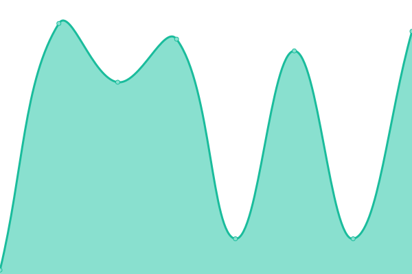
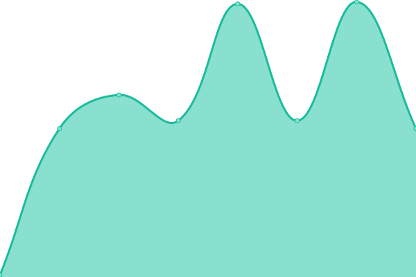

# [📈 Live Status](https://KintaMiao.github.io/miasaupptime): <!--live status--> **🟩 All systems operational**

This repository contains the open-source uptime monitor and status page for [Kinta 肥喵喵喵](https://KintaMiao.github.io/miasaupptime), powered by [Upptime](https://github.com/upptime/upptime).

With [Upptime](https://upptime.js.org), you can get your own unlimited and free uptime monitor and status page, powered entirely by a GitHub repository. We use [Issues](https://github.com/KintaMiao/miasaupptime/issues) as incident reports, [Actions](https://github.com/KintaMiao/miasaupptime/actions) as uptime monitors, and [Pages](https://KintaMiao.github.io/miasaupptime) for the status page.

<!--start: status pages-->
<!-- This summary is generated by Upptime (https://github.com/upptime/upptime) -->
<!-- Do not edit this manually, your changes will be overwritten -->
<!-- prettier-ignore -->
| URL | Status | History | Response Time | Uptime |
| --- | ------ | ------- | ------------- | ------ |
|  [Miasa Network Website](https://miasanet.tech) | 🟩 Up | [miasa-network-website.yml](https://github.com/KintaMiao/miasaupptime/commits/HEAD/history/miasa-network-website.yml) | 

 144ms
     
 | 

<a href="https://KintaMiao.github.io/miasaupptime/history/miasa-network-website">100.00%</a>
    

|  [HK Main Server](45.125.12.212) | 🟩 Up | [hk-main-server.yml](https://github.com/KintaMiao/miasaupptime/commits/HEAD/history/hk-main-server.yml) | 

 194ms
     
 | 

<a href="https://KintaMiao.github.io/miasaupptime/history/hk-main-server">100.00%</a>
    

|  [Hong Kong VPS](103.169.126.229) | 🟩 Up | [hong-kong-vps.yml](https://github.com/KintaMiao/miasaupptime/commits/HEAD/history/hong-kong-vps.yml) | 

 194ms
     
 | 

<a href="https://KintaMiao.github.io/miasaupptime/history/hong-kong-vps">96.92%</a>
    

|  [USA VPS](208.87.240.5) | 🟩 Up | [usa-vps.yml](https://github.com/KintaMiao/miasaupptime/commits/HEAD/history/usa-vps.yml) | 

 42ms
     
 | 

<a href="https://KintaMiao.github.io/miasaupptime/history/usa-vps">100.00%</a>
    

|  [UK(GB) VPS](146.103.53.18) | 🟩 Up | [uk-gb-vps.yml](https://github.com/KintaMiao/miasaupptime/commits/HEAD/history/uk-gb-vps.yml) | 

 98ms
     
 | 

<a href="https://KintaMiao.github.io/miasaupptime/history/uk-gb-vps">99.51%</a>
    

|  [Korea VPS](chuncheon.guapi.me) | 🟩 Up | [korea-vps.yml](https://github.com/KintaMiao/miasaupptime/commits/HEAD/history/korea-vps.yml) | 

 167ms
     
 | 

<a href="https://KintaMiao.github.io/miasaupptime/history/korea-vps">100.00%</a>
    

<!--end: status pages-->

[**Visit our status website →**](https://KintaMiao.github.io/miasaupptime)

## 📄 License

- Powered by: [Upptime](https://github.com/upptime/upptime)
- Code: [MIT](./LICENSE) © [Anand Chowdhary](https://anandchowdhary.com), supported by [Pabio](https://pabio.com)
- Data in the `./history` directory: [Open Database License](https://opendatacommons.org/licenses/odbl/1-0/)
